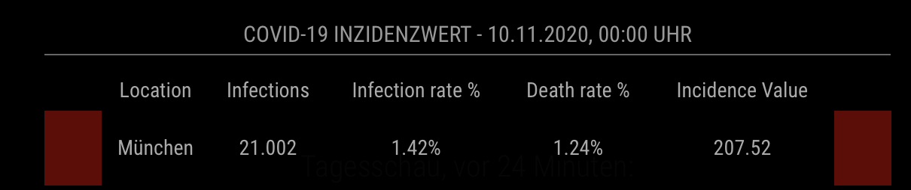

# MMM-COVID19-AMPEL
A [MagicMirror²](https://magicmirror.builders) helper module to display the COVID 19 INCIDENCE Value in form of the four stages in Germany (Green, Yellow, Red and Dark - Red).

[](https://raw.githubusercontent.com/magic21nrw/MMM-COVID19-AMPEL/master/LICENSE)

 

## Installation

In your terminal, go to your MagicMirror's Module folder:
````
cd ~/MagicMirror/modules
````

Clone this repository:
````
git clone https://github.com/magic21nrw/MMM-COVID19-AMPEL.git
````

Add the module to the modules array in the `config/config.js` file:
````javascript
  {
    module: "MMM-COVID19-AMPEL"
  },
````

## Configuration options

The following properties can be configured:


| Option                       | Description
| ---------------------------- | -----------
| `header`                     | The header text <br><br> **Default value:** `'COVID-19 Inzidenzwert'`
| `cityID`                     | The ObjectID of the GEN City from this database in an array: `'https://npgeo-corona-npgeo-de.hub.arcgis.com/datasets/917fc37a709542548cc3be077a786c17_0/data'` <br><br> **Possible values:** Array: `["224" , "223"]` for Ingolstadt and München <br> **Default value:** `["224"]`
| `infoRowClass`               | The font size of data <br><br> **Possible values:** `'small'`, `'medium'` <br> **Default value:** `'small'`
| `showUpdateDateInHeader`     | Show date of update in Header (of last received item) <br><br> **Possible bool values:** `true`, `false` <br> **Default value:** `true`
| `showUpdateDateInRow`        | Show date of update in each row  <br><br> **Possible bool values:** `true`, `false` <br> **Default value:** `false`
| `showStatusLightLeft`        | Show status light on left side according to incidence value<br><br> **Possible bool values:** `true`, `false` <br> **Default value:** `true`
| `showStatusLightRight`       | Show status light on right side according to incidence value <br><br> **Possible bool values:** `true`, `false` <br> **Default value:** `false`
| `updateInterval`             | How often does the content needs to be fetched? (Milliseconds) <br><br> **Possible values:** `1000` - `86400000` <br> **Default value:** `3600000` (60 minutes)
| `showTitle`                  | Show a title over each column of information provided if you want to show more than one information.<br><br> **Possible bool values:** `true`, `false` <br> **Default value:** `true`
| `showCases`                  | Show total number of people infected <br><br> **Possible bool values:** `true`, `false` <br> **Default value:** `true`
| `showCasesPerPeople`         | Show % of cases per people in this city/region  <br><br> **Possible bool values:** `true`, `false` <br> **Default value:** `true`
| `showDeathRatePerPeople`     | Show death rate of people <br><br> **Possible bool values:** `true`, `false` <br> **Default value:** `true`
| `show7DayIncidence`          | Show 7 day incidence value which corresponds to the status light <br><br> **Possible bool values:** `true`, `false` <br> **Default value:** `true`
| `numberOfDigits`             | Number of digits for percentage values to show.<br><br> **Possible int values:** `0`, `1` or `2` <br> **Default value:** `2`
| `fadeSpeed`                  | Fading speed when module is updating. No need to change it... <br><br> **Possible values:** `1000` - `86400000` <br> **Default value:** `4000`

## Config Example

````javascript
{
  module: 'MMM-COVID19-AMPEL',
  position: 'top_center',
  config:	{
    header: 'COVID-19 Inzidenzwert', // Header Title of Display on MagicMirror
    cityID: ["224","223"], // City ID from  https://npgeo-corona-npgeo-de.hub.arcgis.com/datasets/917fc37a709542548cc3be077a786c17_0/data
    infoRowClass: "small", // small, medium
    showUpdateDateInHeader: true, //Show update date in header
    showUpdateDateInRow: false, //Show update date in each row
    showStatusLightLeft: true, //Show left status light
    showStatusLightRight: true, // Show right status light
    showTitle: true, //Show Title row with headlines if you want to display more than one information
    showCases: true, //Show amount of active cases in city
    showCasesPerPeople: true, //Show Percentage of active cases per inhabitant
    showDeathRatePerPeople: true, //show death rate in % of infected people
    show7DayIncidence: true, // Show 7 day incidence value for your location
    numberOfDigits: 2, //Round the Percentage and incidence value to number of digits
    updateInterval: 3600000, // update interval in milliseconds // 1 Hour - Values are only refreshed every 24 H on Server
    fadeSpeed: 4000
	}
},
````

## Updating

To update the module to the latest version, use your terminal to go to your MMM-COVID19-AMPEL module folder and type the following command:

````
git pull
```` 


Feel free to open any Issue :smiley:
